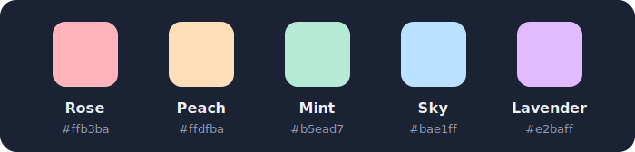

	

An [Obsidian](https://obsidian.md) plugin that tints tab headers with custom colors, so you can tell open notes apart at a glance.

## Why

When you work across several notes at once — researching, cross-referencing, writing — finding the right tab by its title alone is slow. Tab Tint gives each tab a color you assign, so your eyes jump straight to it:

- 🔴 **Rose** — the note you're actively writing
- 🟠 **Peach** — diagrams supporting the work
- 🟢 **Mint** — reference material you keep returning to
- 🔵 **Sky** — other useful references
- 🟣 **Lavender** — meeting notes and logs

A tint means something: each tab remembers which palette slot you gave it. Recolor the slot in settings and every tab wearing it updates — your "reference material" color stays your reference-material color, whatever hex it points at today.

## Install

**Manually (until the plugin is listed in the community directory):**

1. Download `main.js`, `manifest.json`, and `styles.css` from the [latest release](https://github.com/CypherPoet/obsidian-tab-tint/releases/latest).
2. Copy them into `<your-vault>/.obsidian/plugins/tab-tint/`.
3. Reload Obsidian, then enable **Tab Tint** under **Settings → Community plugins**.

## Use

**Tint a tab** — right-click any tab header and pick a color from the bottom of the menu. Each entry shows a swatch of the color it applies.

**Clear a tint** — right-click a tinted tab and choose **Clear tint**.

**Commands** (assignable to hotkeys under **Settings → Hotkeys**):

| Command | What it does |
| --- | --- |
| Apply tint 1–5 | Tint the current tab with that palette slot |
| Clear tint | Remove the current tab's tint |
| Clear all tints | Remove every tint in the vault |
| Merge duplicate tabs | Close extra tabs showing the same file, keeping the active one |

Merging never happens automatically — it only runs when you invoke the command, so split panes and deliberate duplicates are safe.

**Behavior notes:**

- Tints follow a file through renames and moves.
- Tinted tabs are pinned automatically (and unpinned when cleared) — toggle **Auto-pin tinted tabs** off in settings if you'd rather manage pins yourself.
- Tab text switches between dark and light ink based on the tint, so labels stay readable on any color.
- Works in popout windows; sidebar panels are deliberately left untouched.
- Renaming a palette color updates its command name after the app reloads.

## Default palette

	

| Slot | Name | Hex |
| --- | --- | --- |
| 1 | Rose | `#ffb3ba` |
| 2 | Peach | `#ffdfba` |
| 3 | Mint | `#b5ead7` |
| 4 | Sky | `#bae1ff` |
| 5 | Lavender | `#e2baff` |

Every slot's name and color is editable under **Settings → Tab Tint**; **Reset palette** restores the pastels above.

## Credits

Tab Tint is a clean reimplementation inspired by [ColorTab](https://github.com/rordaz/ColorTab) by Rafael Ordaz (MIT).

## License

[MIT](LICENSE)
